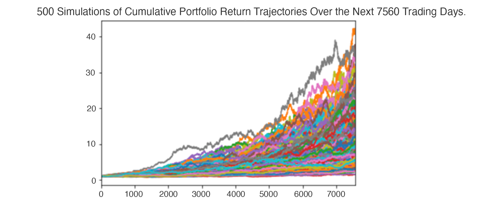

# Module-5-Challenge - Financial planner

In Module 5 Challenge FinTech Columbia University Boot Camp we created two financial analysis tools by using a single Jupyter notebook:

* A financial planner for emergencies. The members will be able to use this tool to visualize their current savings. The members can then determine if they have enough reserves for an emergency fund.

* A financial planner for retirement. This tool will forecast the performance of their retirement portfolio in 30 years. To do this, the tool will make an Alpaca API call via the Alpaca SDK to get historical price data for use in Monte Carlo simulations.


---

## Technologies

Python 3.7.11 with additional libraries:

Install the Fire and Questionary libraries executing following commands:

```python jupyter lab
```

---

## Usage

The following details the instructions on how to run the application.  

### Run the Application

[click here for information on Jupyter Lab](https://jupyterlab.readthedocs.io/en/stable/).  

Run **financial_planning_tools.ipynb** file.  

---

## Contributors

Grigory Timofeev

[E-mail](fintech_github_challenge5@unloca.com)

---

## License

The MIT License (MIT)

Copyright (c) 2022 Grigory Timofeev

Permission is hereby granted, free of charge, to any person obtaining a copy of this software and associated documentation files (the "Software"), to deal in the Software without restriction, including without limitation the rights to use, copy, modify, merge, publish, distribute, sublicense, and/or sell copies of the Software, and to permit persons to whom the Software is furnished to do so, subject to the following conditions:

The above copyright notice and this permission notice shall be included in all copies or substantial portions of the Software.

THE SOFTWARE IS PROVIDED "AS IS", WITHOUT WARRANTY OF ANY KIND, EXPRESS OR IMPLIED, INCLUDING BUT NOT LIMITED TO THE WARRANTIES OF MERCHANTABILITY, FITNESS FOR A PARTICULAR PURPOSE AND NONINFRINGEMENT. IN NO EVENT SHALL THE AUTHORS OR COPYRIGHT HOLDERS BE LIABLE FOR ANY CLAIM, DAMAGES OR OTHER LIABILITY, WHETHER IN AN ACTION OF CONTRACT, TORT OR OTHERWISE, ARISING FROM, OUT OF OR IN CONNECTION WITH THE SOFTWARE OR THE USE OR OTHER DEALINGS IN THE SOFTWARE.